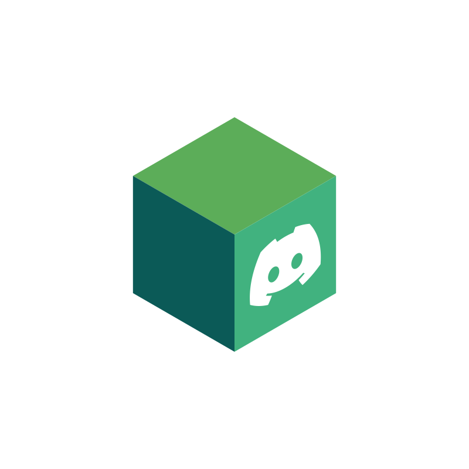

<p align="center">
  
</p>

# Disbox

A Discord bot that integrates with the TorBox API, allowing you to manage torrent and file downloads directly from Discord — with an optional web dashboard.

## 📋 Features

- **Torrents**
  - Add torrents via magnet link or `.torrent` file
  - Automatic progress monitoring
  - Completion notifications with download links
  
- **Web Downloads**
  - Direct downloads from supported hosters (Mega, Rapidgator, etc.)
  - Check available hosters
  
- **Search**
  - Search for movies, TV shows, and anime by title
  - Search torrents directly
  - Information about quality, subtitles, and cache status
  
- **Management**
  - List all active downloads
  - Check detailed download status
  - Support for multiple API keys with automatic fallback
  - Cache-only mode for instant downloads

- **Web Dashboard** *(optional)*
  - Sign in with Discord OAuth2
  - Add torrents and web downloads from a browser
  - Browse download history
  - Links open a built-in file browser with media viewer
  - **Admin Dashboard**: Moderation tools, global download history, and interactive user profiles
  - **Access Control**: Built-in Whitelist/Blacklist toggle system to restrict bot access to specific users

- **Proxy & File Browser**
  - Persistent download links that survive server restarts
  - File browser with search and sorting
  - Built-in media viewer for video and image files
  - Text file reader for `.txt`, `.nfo`, `.log`, etc.

## 🚀 Installation

### Prerequisites

- Go 1.25.4 or higher
- A [TorBox](https://torbox.app/) account
- A Discord bot ([create one](https://discord.com/developers/applications))

### Setup

1. Clone the repository:
```bash
git clone https://github.com/gabrieljcodes/disbox
cd disbox
```

2. Install dependencies:
```bash
go mod download
```

3. Configure environment variables:
```bash
cp .env.example .env
```

4. Edit the `.env` file:
```env
# Discord Bot Token
DISCORD_BOT_TOKEN="your_token_here"

# TorBox API Key(s)
# Single key:
TORBOX_API_KEY="your_key_here"

# Multiple keys (automatic fallback):
TORBOX_API_KEY="key1,key2,key3"

# Cache-only mode (cached torrents only)
CACHE_ONLY=false
```

5. Run the bot:
```bash
go run main.go
```

## 📝 Commands

| Command | Description |
|---------|-------------|
| `/add-torrent` | Add a torrent via magnet link or file |
| `/add-web-download` | Add a web download |
| `/list-downloads` | List all active downloads |
| `/torrent-status` | Check the status of a specific torrent |
| `/webdl-status` | Check the status of a web download |
| `/hosters` | List all available hosters |
| `/search-hoster` | Search for information about a specific hoster |
| `/search-media` | Search for movies, TV shows, or anime |
| `/search-torrents` | Search for torrents by name |

## ⚙️ Advanced Features

### Multiple API Keys

The bot supports multiple TorBox API keys for automatic fallback when one key reaches the download limit:

```env
TORBOX_API_KEY="key1,key2,key3"
```

### Cache-Only Mode
* Useful if you don't want downloads to take up space in your active downloads.

Enable cache-only mode to download only torrents that are already cached (instant downloads):

```env
CACHE_ONLY=true
```

> **Note:** Web downloads are disabled in cache-only mode.

### Web Dashboard

The optional web dashboard lets you manage downloads from a browser with Discord OAuth2 authentication.

#### Setup

1. Go to the [Discord Developer Portal](https://discord.com/developers/applications) → Your App → **OAuth2**
2. Add a redirect URL: `{PROXY_BASE_URL}/auth/callback` (e.g., `http://localhost:8080/auth/callback`)
3. Set the environment variables:

```env
DISCORD_CLIENT_ID="your_client_id"
DISCORD_CLIENT_SECRET="your_client_secret"

# To enable the Admin Dashboard (optional)
ADMIN_USERS="your_discord_id_here"
```

4. Access the dashboard at `http://localhost:8080/dashboard` (or your configured `PROXY_BASE_URL`)

> **Note:** If `DISCORD_CLIENT_ID` and `DISCORD_CLIENT_SECRET` are not set, the dashboard is disabled and the server works as a proxy-only server.

### Proxy Server Configuration

The proxy server hosts download links, the file browser, and the web dashboard. Configuration:

```env
# Port (default: 8080)
PROXY_PORT=8080

# Public base URL (required when behind a reverse proxy or custom domain)
PROXY_BASE_URL="https://your-domain.com"
```

> **Important:** `PROXY_BASE_URL` is used for generating OAuth2 callbacks and download links sent through Discord. If not set, it defaults to `http://localhost:{PROXY_PORT}`. When running behind a reverse proxy (e.g., Cloudflare Tunnel, nginx), set this to your public URL.

### Automatic Monitoring

The bot automatically monitors download progress and sends notifications:
- Progress at 25%, 50%, and 75%
- Notification when the download is complete
- Download link valid for 3 hours

## 🔌 Public REST API

Disbox provides a public REST API that allows you to integrate your downloads with other services (like Sonarr, Radarr, or custom scripts).

For complete documentation on endpoints, authentication, and examples, please see the [API Documentation](API.md).

## 🔧 Build

To compile the bot:

```bash
go build -o torbox-bot
```

Run the binary:
```bash
./torbox-bot
```

## 📦 Dependencies

- [discordgo](https://github.com/bwmarrin/discordgo) - Discord library for Go
- [godotenv](https://github.com/joho/godotenv) - Environment variable loader
- [modernc.org/sqlite](https://pkg.go.dev/modernc.org/sqlite) - Pure Go SQLite driver

## 🤝 Contributing

Contributions are welcome! Feel free to open issues or pull requests.

## 📄 License

This project is open source and available under the GPL-3.0.

## ⚠️ Disclaimer

This bot is an unofficial third-party tool. Use it in accordance with TorBox and Discord's terms of service.